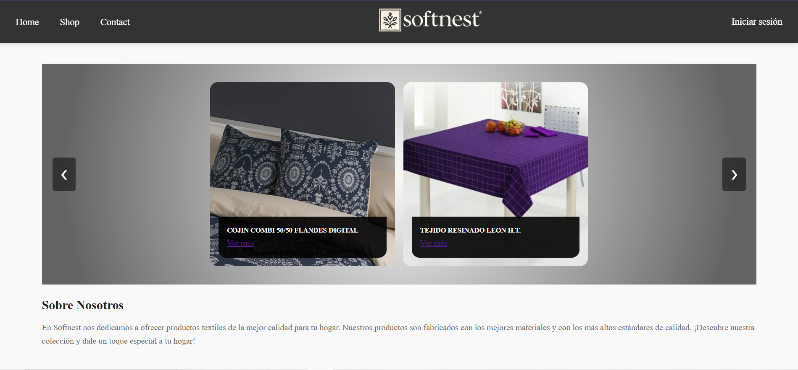
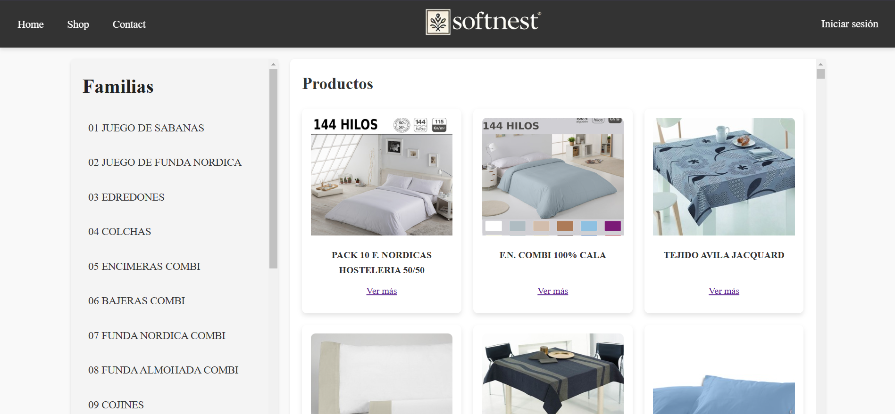
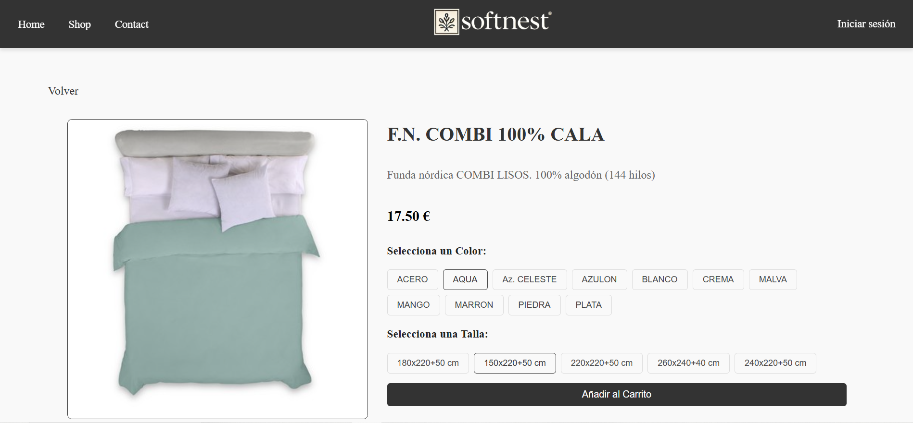
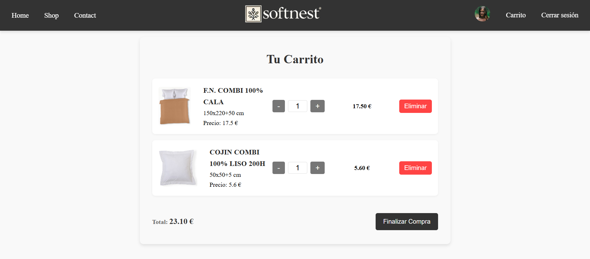
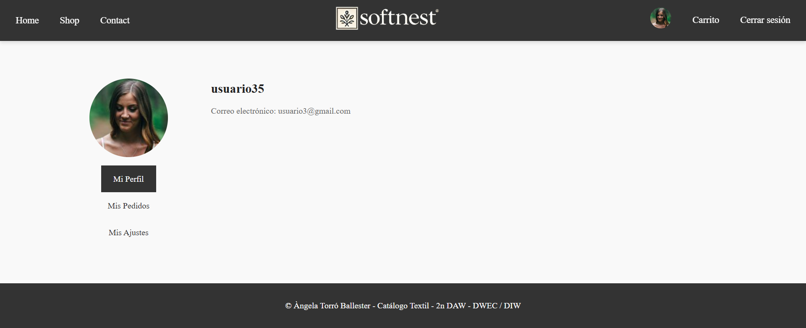
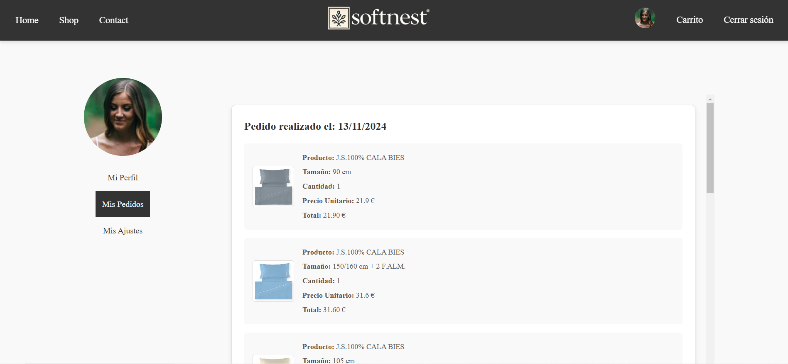
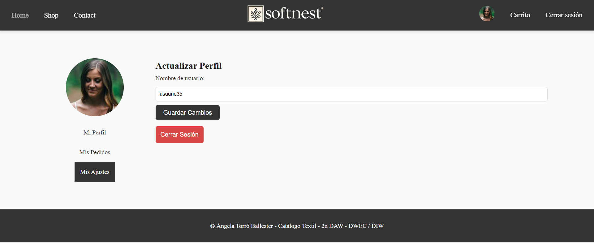
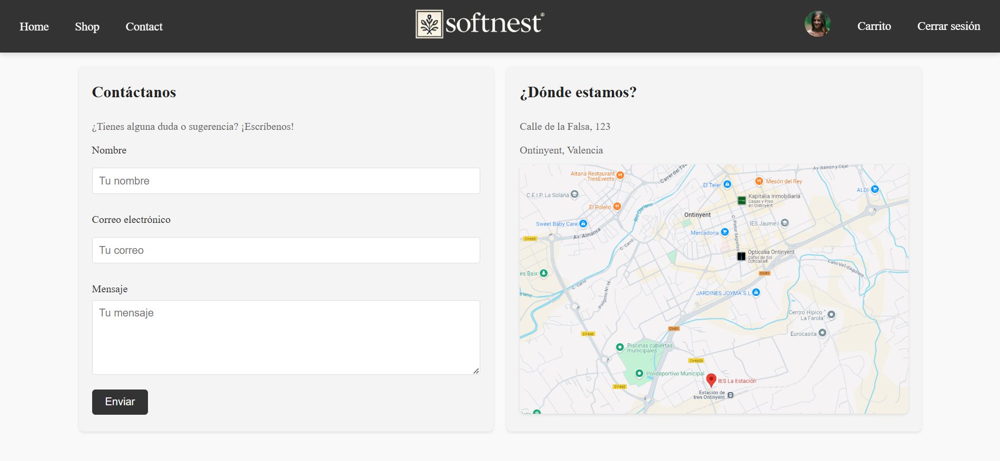

# Softnest - Catálogo Digital de Productos para el Hogar 🛏️

Softnest es una aplicación web diseñada para mostrar un catálogo digital de productos textiles para el hogar. Ofrece una experiencia de usuario atractiva, con funcionalidades como la visualización de productos recientes, un carrito de compras, y perfiles de usuario. Navega entre las diferentes secciones para encontrar el producto perfecto para tu hogar.

## Tabla de Contenidos
1. [Inicio](#inicio)
2. [Tienda](#tienda)
3. [Detalles de Producto](#detalles-de-producto)
4. [Carrito de Compras](#carrito-de-compras)
5. [Perfil de Usuario](#perfil-de-usuario)
   - [Historial de Pedidos](#historial-de-pedidos)
   - [Ajustes de Usuario](#ajustes-de-usuario)
6. [Contacto](#contacto)

---

### Inicio
La página de inicio es el punto de entrada a la aplicación. Aquí encontrarás un **carrusel de productos destacados** en pantalla completa, una sección "Sobre Nosotros" que detalla la misión de Softnest, y una galería de **productos recientemente vistos**.  
Haz clic en los productos para explorar más detalles sobre ellos.

#### Funcionalidades
- Navegar por productos destacados en el carrusel.
- Leer sobre Softnest en la sección "Sobre Nosotros".
- Acceder a productos recientemente vistos con enlaces rápidos a sus detalles.

### Tienda
En la sección de **Tienda** podrás navegar por el catálogo completo de productos, organizado en **familias** y **subfamilias**.  
Usa el menú lateral para filtrar productos por categorías y subcategorías y encuentra lo que estás buscando de forma rápida y sencilla.

#### Funcionalidades
- Filtrar productos por familias y subfamilias.
- Ver todos los productos disponibles en el catálogo.
- Acceder a los detalles de cada producto desde su tarjeta.

### Detalles de Producto
La página de **Detalles** proporciona una vista detallada de cada producto. Aquí puedes:
- Ver una imagen ampliada del producto.
- Seleccionar **colores** y **tallas** disponibles.
- Añadir el producto al carrito de compras si hay stock disponible.

#### Funcionalidades
- Ver imagen, nombre y descripción del producto.
- Seleccionar variaciones de color y talla.
- Añadir productos al carrito.

### Carrito de Compras
En el **Carrito de Compras** puedes revisar los artículos seleccionados, actualizar cantidades y proceder al pago.  
Cada producto muestra su **imagen**, **nombre**, **tamaño**, y el **precio total**.  
Al hacer clic en "Finalizar Compra", los datos de la compra se guardan y puedes revisarlos en tu historial de pedidos.

#### Funcionalidades
- Visualizar y modificar las cantidades de cada artículo en el carrito.
- Eliminar artículos del carrito.
- Finalizar la compra y guardar el pedido en el historial.

### Perfil de Usuario
La página de **Perfil** permite al usuario gestionar su cuenta y ver su historial de compras. Incluye:
1. **Mi Perfil**: Muestra la información general del usuario y permite editar el nombre de usuario.
2. **Historial de Pedidos**: Muestra una lista de pedidos realizados con sus detalles.
3. **Ajustes de Usuario**: Permite realizar ajustes básicos de la cuenta, como cambiar el nombre de usuario.

#### Funcionalidades en el Perfil
- Actualizar el nombre de usuario en los ajustes.
- Ver el historial de pedidos completos con sus detalles.
- Gestionar la cuenta de usuario.

#### Historial de Pedidos
Aquí puedes visualizar los pedidos realizados, incluyendo los **productos comprados**, la **fecha de compra**, y el **total** del pedido.

#### Ajustes de Usuario
Permite cambiar tu nombre de usuario y actualizar la información de cuenta en general.

### Contacto
La sección de **Contacto** proporciona un formulario de contacto donde los usuarios pueden enviar consultas o comentarios a Softnest.  
Es un formulario simple y fácil de usar, diseñado para una rápida comunicación con el equipo de atención al cliente.

